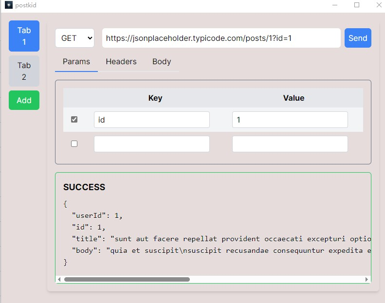

<h1>Postkid</h1>

<b>A lightweight tool offering key functionalities inspired by Postman.</b>

Demo

## Todo
- [ ] 测试post的form-data
- [ ] 实现仿postman的url输入框:双向修改、完整显示
- [x] 实现多开标签页
- [ ] 实现用户记录保存
- [ ] 实现自适应窗口大小
- [ ] 可对tab进行命名和删除
- [x] 引入Github Action，自动构建
- [x] 重构ParamTable，HeaderTable，FormTable三个组件

## Warn 
- Potential Issues with Tauri
- Tested Solely on Windows 10

## 踩坑与收获
参加 [Postkid | EuDs's Blog](https://ds63.eu.org/2024/postkid/)

## 参考链接
- [OnceLock in std::sync - Rust](https://doc.rust-lang.org/std/sync/struct.OnceLock.html)
- [Next.js Documentation](https://nextjs.org/docs) - learn about Next.js features and API.
- [Learn Next.js](https://nextjs.org/learn) - an interactive Next.js tutorial.
- [【Rust 日报】2023-11-26 Rust全局变量，两年过去了-腾讯云开发者社区-腾讯云](https://cloud.tencent.com/developer/article/2364764?areaId=106001)
- [PrismJS/prism: Lightweight, robust, elegant syntax highlighting.](https://github.com/PrismJS/prism/)
- [react-simple-code-editor/react-simple-code-editor: Simple no-frills code editor with syntax highlighting](https://github.com/react-simple-code-editor/react-simple-code-editor)
- [React 中后台系统多页签实现 ｜ 项目复盘 - 掘金](https://juejin.cn/post/6941683774153293837)
- [Family — Jotai, primitive and flexible state management for React](https://jotai.org/docs/utilities/family)
- [[如何解决安装失败] · Issue #7338 · tauri-apps/tauri](https://github.com/tauri-apps/tauri/issues/7338#issuecomment-1923680714)
- [高级特性: 动态导入（Import） | Next.js | Next.js中文网](https://www.nextjs.cn/docs/advanced-features/dynamic-import)
- [真的不可以在 React 组件内部嵌套定义子组件吗？ - PRIN BLOG](https://prin.pw/react-unstable-nested-components/)
- [useCallback – React](https://react.dev/reference/react/useCallback)
- [pnpm/action-setup: Install pnpm package manager](https://github.com/pnpm/action-setup)